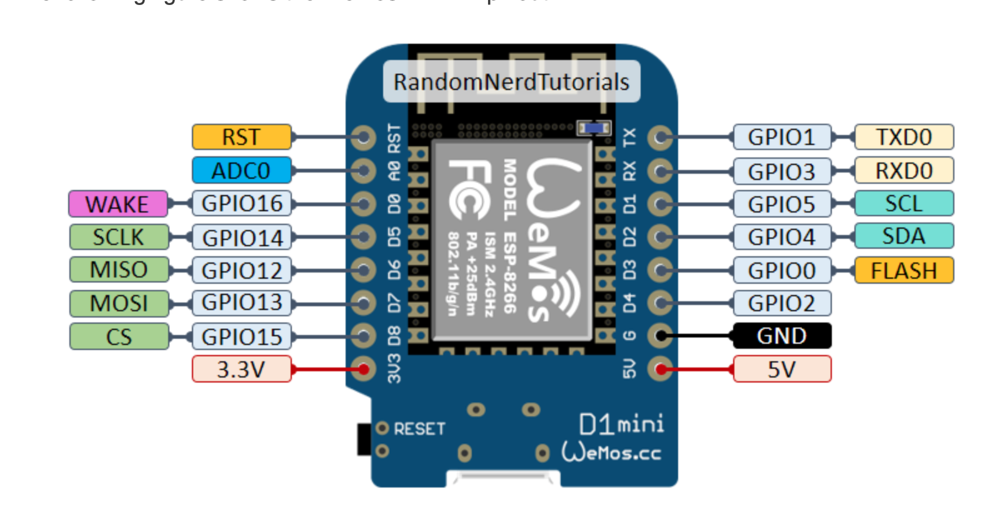

# Lithophane
## What the heck is a lithophane?
[Wikipedia](https://en.wikipedia.org/wiki/Lithophane) says it best but basically a lithophane is a photo or image that has layers with varying thickness that, when backlit, shows a detailed image
## Components/Equipment/STL
- [ESP8266 D1 Mini](https://www.amazon.com/Organizer-ESP8266-Internet-Development-Compatible/dp/B081PX9YFV/ref=sr_1_3?crid=109ZXS64RHJ6L&keywords=esp8266+d1+mini&qid=1662656774&sprefix=esp8266+d1%2Caps%2C203&sr=8-3)
- Soldering Iron w/ wire ( Jumper cables will be easiest)
- 3D Printer or Access to one
- Micro USB cable that supports data transfer
- [WS2812B LED strip](https://www.amazon.com/dp/B01CDTED80?psc=1&ref=ppx_yo2ov_dt_b_product_details)
- [3D Print STL File](https://www.thingiverse.com/thing:4831736) (I scaled mine to 70% in order for it to fit on my printer)
- I also bought these [connectors](https://www.amazon.com/dp/B08KHHKT5N?psc=1&ref=ppx_yo2ov_dt_b_product_details) to make it easier to connect the strips. 
**Note:** If you use different LED strips and want connectors as well, make sure the connector as the same amount of pins as your rgb strip  
**Note:** Some soldering experience required. The task isnt too difficult but may require some know how
## Procedure
1. Print the 3D STL file
1. In order to make the cabling look nicer, I drilled a whole in the back that was about a 5mm in diameter that I then threaded the led strips cables through 
2. Preheat Soldering iron  
**!!CAUTION!!** Iron will be HOT!
3. Most LED strips come with cable adapters that make it easier to connect multiple strips together. For this project I didnt need those so I cut the end off as close to the tip as possible so I could use the connecting wires. The other red and white cables are there in case you wanted to use a more powerful power supply. But since we arent using a lot of LEDs we can clip those off 
4. Once you have clipped the end off, thread the cables through the hole.
5. Solder on the clipped LED cables to the D1 Mini in this way. Green -> GPIO pin (I chose D6); Red -> 5V pin; White -> Ground pin. 
6. Once soldered, we can now start attaching the LEDs. The LEDs in the description have sticky tape on the back that can be peeled to stick to the 3D print
**TIP:** Add solder to the led pads and connecting wires to help with adhesion between the cable and LED strip.
**NOTE:** The steps from here correspond to a print that was scaled to 70% of the original size of the print
7. the first row of LEDs has 10 leds on it. Before taping it down, make sure to add solder to the cables and LED pads.  
**NOTE:** There are arrows on the LED strip. They should flow like this for this project:  
3rd Row > ----------->    
2nd Row ^ <--------- <   
1st Row -----------> ^   
BOTTOM of Print  
**If they arent facing the right way, the LEDs will not work properly**

1. Solder each pad to its corresponding pad on the next strip. 5V -> 5v; GND -> GND, DO -> DIN; 
2. Repeat step 8 for the next two rows; Row 2 and 3 both have 11 LEDs on them.
**TIP:** Test your strips along the way to make sure your LEDs are connected properly. Just plug the 5V power supply in and attach the micro USB cable to the D1 Mini
10. Once this is all done, it should look like this. 
### WLED
#### Installation
- This [tutorial](https://kno.wled.ge/basics/install-binary/) page should help with installing it on your D1 Mini. I was able to do the first option
- Go to your WLED webpage. Go to LED Preferences and make the GPIO pin equal 12 (if you used D6 as the input pin) and set the number of LEDs to 32. You might have to mess with type of LED strip as well as the RGB order. From there you can adjust colors and anything else in web interface.
## Troubleshooting
- The pins on the D1 Mini do not reference their respective gpio pin. For example the D6 pin is GPIO 12 not GPIO 6. This comes into play when using WLED. 
- If the strips arent working, its possible that there is solder or cables overlapping on the pads on the LED strips. This interrupts the signal and causes the leds to not work properly
